<!-- Aesthetic polybar -->

 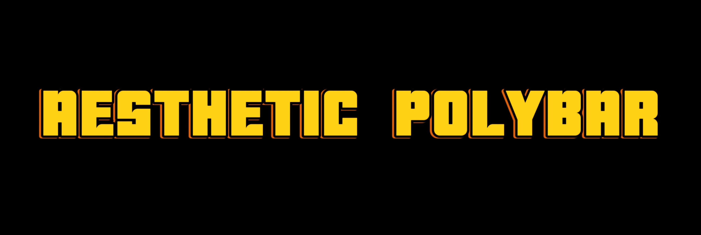

<p align="center">
  
  
  
</p>


## 


 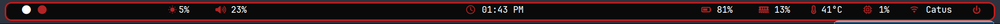


 

##


## Introduction
Welcome to the Aesthetic-Polybar repository! This collection features beautifully designed Polybar themes tailored for various styles and preferences, including dark mode, light mode, and more. Customize your desktop environment with ease and style. This polybar themes were design for i3WM. Read the warnings for more

## Features
- 🌑  **Dark Mode Themes**: Sleek and modern designs for dark mode enthusiasts.
- 🌕 **Light Mode Themes**: Clean and bright themes for light mode users.
- 🎨 **Custom Colors**: Easily switch between different color schemes.
- 🚀 **Easy Installation**: Simple scripts to install and apply themes.

## Showcase

<details>
<summary><b>Dark-theme 🌑 </b></summary>

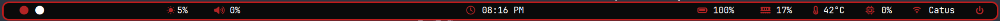


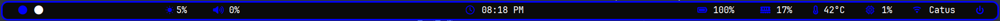

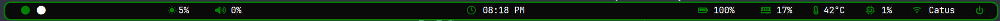

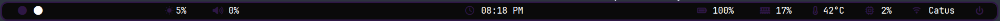


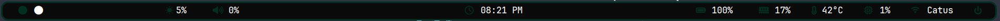


</details>


<details>
<summary><b>Light-theme 🌕 </b></summary>


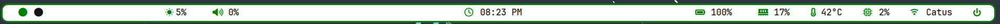


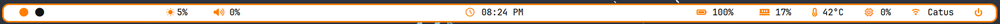

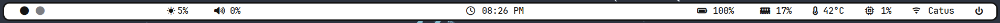


</details>

## Requirements
- **Polybar**: Make sure you have Polybar installed. You can follow the instructions [here](https://github.com/polybar/polybar).
- **Pywal**: Required for pywal themes.


## Installation
### Step 1: Clone the Repository
```sh
git clone https://github.com/Alopes01/Aesthetic-Polybar.git
cd Aesthetic-Polybar
```
### Step 2: Make the two scripts executable
```sh
chmod +x install.sh
chmod +x test.sh
```
### Step 3: Run the installer script
```sh
./install.sh
```
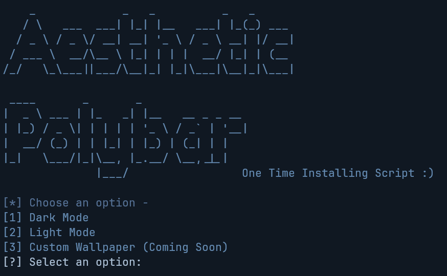

- This script will install fonts and copy the polybar configs to the ``.config`` folder, if you have any polybar configs there the script will make a backup of them.

- After that, you can select the options that you'd like to test and the script will output them for you.

## Testing bars multiple times 

You can't run the installer script multiple times, so there is a script to do it :

```sh
./test.sh
```
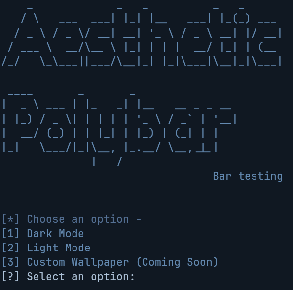

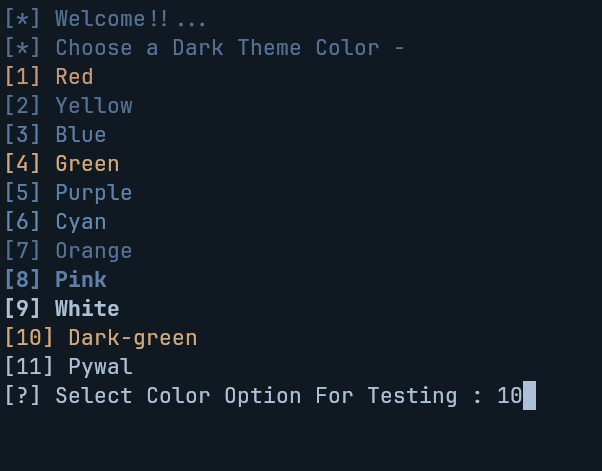

## Dont forget to:
Set the polybar to execute on startup ``polybar -c $HOME/.config/polybar/(theme)/(COLOR).ini``  (copy this line and set it to execute on start up)

## What this repo doesn't contain ❌
- Rofi powermenu and wifimenu scripts, I recommend [these](https://github.com/adi1090x/rofi)

- Custom Wallpaper support, but if this repo reaches to 60 stars ⭐️, this month there will be a survey in the issues where you will post your favourite wallpaper. The 10 most popular ones will get a custom colored polybar .

## Example of custom wallpapers

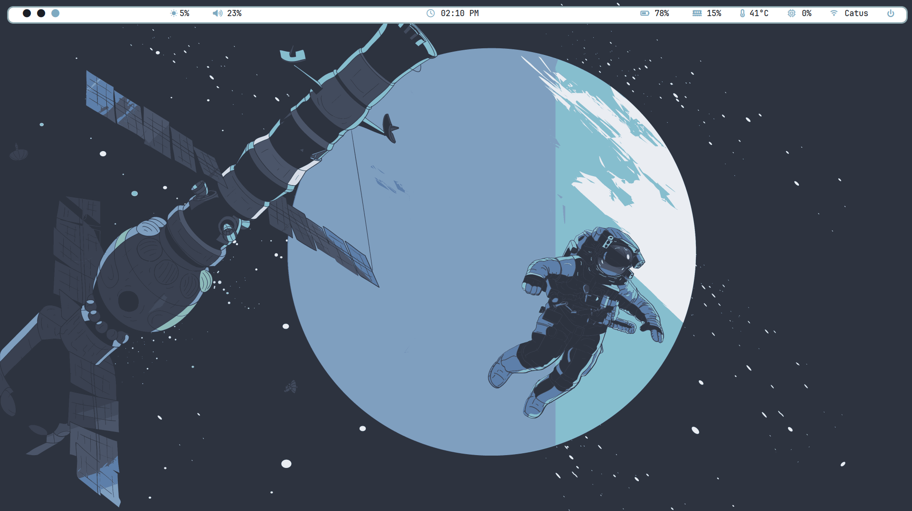

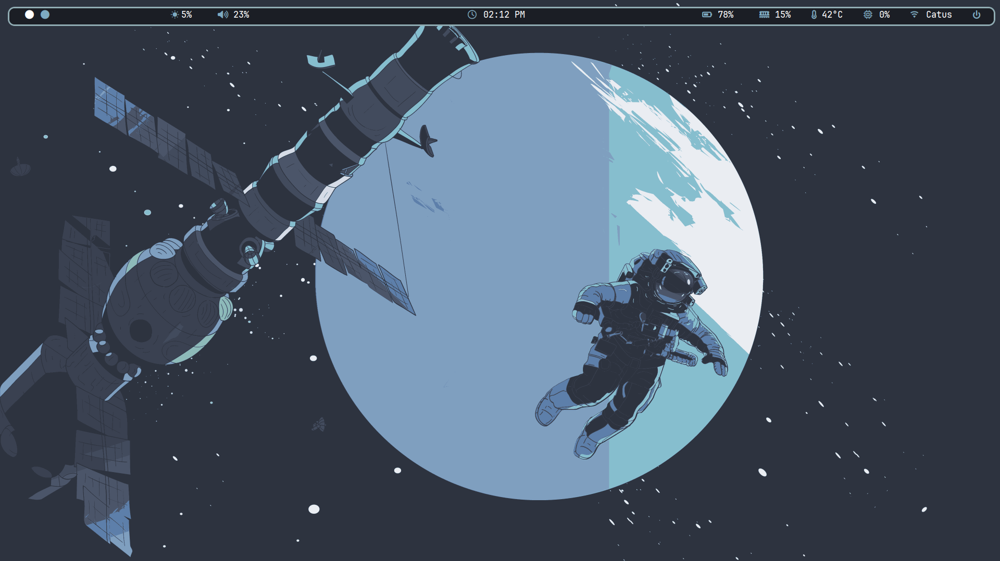


## Warnings ⚠️

Please i'm a human if you find any errors report them in the issues section

- If the temperature module doesn't work try, changing to your grafics card in the polybar config.
- For those who want to use the dark green color the name of the config is green-dark.ini.

